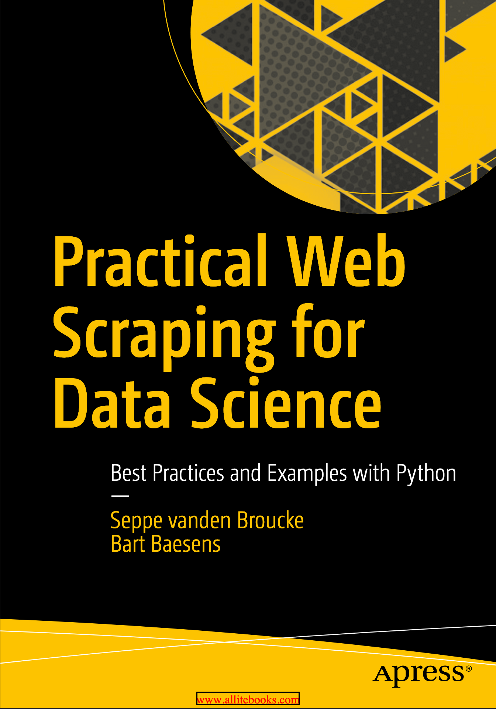

## Practical Web Scraping and Crawling for Data Science: Best Practices and Examples with Python


Hello friends of this [Mr.Rezoo](https://www.linkedin.com/in/reza-mobaraki/)

In this repository we want to explore the depths of crawling and scraping

## Table of contents

* [General info](#General-info)
* [About book](#About-book)
* [Technologies](#Technologies)
* [Help](#Help)
* [Setup](#Setup)
* [Credits](#credits)
* [Contributors](#Contributors)
* [License](#license)

## General info

I decided to implement several small projects in accordance with the book
Practical Web Scraping and Crawling for Data Science and following the contents
of it, to learn how to line up like a professional.

## About book



This book provides a complete and modern guide to web scraping, using Python as
the programming language, without glossing over important details or best
practices. Written with a data science audience in mind, the book explores both
scraping and the larger context of web technologies in which it operates, to
ensure full understanding. The authors recommend web scraping as a powerful tool
for any data scientist’s arsenal, as many data science projects start by
obtaining an appropriate data set.

Starting with a brief overview on scraping and real-life use cases, the authors
explore the core concepts of HTTP, HTML, and CSS to provide a solid foundation.
Along with a quick Python primer, they cover Selenium for JavaScript-heavy
sites, and web crawling in detail. The book finishes with a recap of best
practices and a collection of examples that bring together everything you've
learned and illustrate various data science use cases. What You'll Learn

Leverage well-established best practices and commonly-used Python packages
Handle today's web, including JavaScript, cookies, and common web scraping
mitigation techniques Understand the managerial and legal concerns regarding web
scrapingWho This Book is For A data science oriented audience that is probably
already familiar with Python or another programming language or analytical
toolkit (R, SAS, SPSS, etc). Students or instructors in university courses may
also benefit. Readers unfamiliar with Python will appreciate a quick Python
primer in chapter 1 to catch up with the basics and provide pointers to other
guides as well.

## Technologies

Project is created with:

* Python: 3.9
* requests
* beautifulsoup4
* selenium
* scrapy

## Help

If you are considering a particular method, more modern technology Add to my
project and send merge request, I will add you in the credits and contributors
section

## setup

* first step : create virtual environment

```shell
virtualenv -p python3 venv 
```

* second step : activate virtual environment

```shell
source venv/bin/activate  
```

* third step : install package | library from requirements.txt

```shell
 pip install -r requirements.txt
```

* to run scrapy spiders

```shell
scrapy crawl <spider-name> 
```

if you want to store data in => json, jl, csv, excel

```shell
scrapy crawl <spider-name> -o <file-name.extention> 
```

## Credits

* [Quotes to Scrape](https://quotes.toscrape.com/)
* [Apress](https://github.com/Apress/practical-web-scraping-for-data-science)
* [7learn](https://www.7learn.ac/)
* [mongard](https://www.mongard.ir/courses/python-web-scraping/)

## Contributors

* [MrRezoo](https://github.com/MrRezoo)
* Seppe vanden Broucke | author of Practical Web Scraping and Crawling for Data
  Science

## License

Distributed under the MIT License. See [license](LICENSE) for more information.
